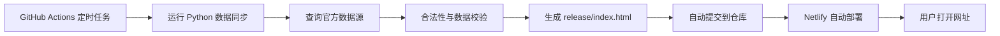

# GitHub Actions 自动更新方案

## 目标

让普通用户打开公开网址时，直接看到已同步到官方最新开奖日期的数据；维护者不需要每期手动上传网页。

## 推荐架构

## 工作方式

1. GitHub 仓库保存项目代码和 `release/index.html`。
2. GitHub Actions 每天定时运行，例如每天 22:30 和 23:30。
3. 脚本先查询官方最新期号和开奖日期。
4. 如果本地已经同步到相同日期和号码，则跳过更新。
5. 如果官方日期/号码发生变化，再抓取并校验完整数据，重新生成单文件网页。
6. 如果网页有变化，Actions 自动提交。
7. Netlify 连接 GitHub 仓库后自动重新部署。
8. 用户打开同一个网址即可看到最新同步日期的数据。

## 你需要做什么

1. 创建或提供一个 GitHub 仓库。
2. 把本项目上传到仓库。
3. 在 Netlify 里把站点连接到这个 GitHub 仓库。
4. 关闭 Netlify 的 Password Protection。
5. 确认 Netlify 发布目录设置为 `release`，发布文件为 `index.html`。

## 我需要做什么

1. 增加 `.github/workflows/update-lottery-data.yml`。
2. 调整脚本，让它先判断官方最新开奖日期是否变化。
3. 只有日期或开奖号码变化时，才更新数据并生成 `release/index.html`。
4. 增加数据源校验与失败保护。
5. 增加页面上的“数据来源、同步到哪一天、免责声明”。
6. 后续扩展多彩种数据源。

## 为什么不直接让浏览器实时抓数据

普通静态网页直接跨域请求官方站点，容易被浏览器 CORS 限制，也可能对官方站点造成不稳定访问。更稳的方式是让 GitHub Actions 在后台定时抓取并生成静态页面。

## 当前建议

先做双色球自动更新闭环，确认稳定后再扩展大乐透、福彩3D、排列3、排列5、七星彩、七乐彩。
