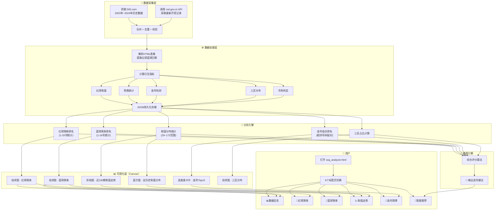

# 双色球分析工具 — 规划流程文档

## 总流程图



---

## 一、数据采集流程

### 步骤 1.1：从 500.com 获取历史数据

```
输入：无（自动）
输出：2003年第03001期 至 2024年第24001期的全部开奖记录
```

| 子步骤 | 操作 | 说明 |
|--------|------|------|
| ① HTTP请求 | `GET history.php?start=03001&end=24001` | 参数为起始和结束期号 |
| ② 编码转换 | GB2312 → UTF-8 | 500.com 使用 GBK 编码 |
| ③ HTML解析 | 正则匹配 `<tr class="t_tr1">` | 提取表格行 |
| ④ 字段提取 | 期号、日期、红球x6、蓝球x1 | 每次拿到约3096条 |
| ⑤ 数据校验 | 检查红球6个、蓝球1个、日期合法 | 过滤无效行 |

### 步骤 1.2：从 cwl.gov.cn 获取最新数据

```
输入：无（自动）
输出：最近100~300期开奖记录
```

| 子步骤 | 操作 | 说明 |
|--------|------|------|
| ① API请求 | `GET findDrawNotice?name=ssq&issueCount=300` | 返回最新300条JSON |
| ② JSON解析 | 直接解析 `result[]` 数组 | 无需编码转换 |
| ③ 字段映射 | code→Issue, date→Date, red→Red, blue→Blue | 统一格式 |

### 步骤 1.3：数据合并与去重

```
输入：两份数据源的结果
输出：唯一、完整、按日期排序的最终数据集
```

| 子步骤 | 操作 |
|--------|------|
| ① 合并 | 两份数据的数组拼接 |
| ② 去重 | 以期号（Issue）为唯一键，Hashtable去重 |
| ③ 排序 | 按日期升序排列 |
| ④ 存储 | 写入 `ssq_data.json`，共3482条 |

---

## 二、数据处理流程

### 步骤 2.1：基础数据提取

```
每条原始记录 → 结构化对象
{
  Issue: "26085",
  Date: "2026-07-26",
  Red: "06,09,13,17,24,28",
  Blue: "15"
}
```

### 步骤 2.2：衍生指标计算

| 指标 | 算法 | 用途 |
|------|------|------|
| **红球和值** | sum(6个红球) | 判断开奖号码大小走势 |
| **奇偶统计** | 每个红球 % 2 累加 | 判断奇偶均衡度 |
| **连号检测** | 排序后相邻差=1则计为连号 | 发现常见连号组合 |
| **三区分布** | 1-11→一区 / 12-22→二区 / 23-33→三区 | 判断区间热度 |
| **冷热判定** | 出现次数 vs 理论均值，偏离阈值 | 标注热号/冷号 |

### 步骤 2.3：频率统计（核心分析）

```
红球频率算法：
  freq[33] = [0,0,...,0]           // 初始化33个计数器
  FOR EACH 开奖记录 IN 3482条:
    FOR EACH 红球 IN 该期6个红球:
      freq[红球号码-1]++            // 对应号码计数器+1
  理论均值 = 3482 × 6 ÷ 33 = 633.1

蓝球频率算法：
  freq[16] = [0,0,...,0]           // 初始化16个计数器
  FOR EACH 开奖记录:
    freq[蓝球号码-1]++
  理论均值 = 3482 ÷ 16 = 217.6
```

---

## 三、可视化渲染流程

### 步骤 3.1：数据 → Canvas 绘制

```
准备阶段            绘制阶段              标注阶段
┌──────────┐      ┌──────────┐         ┌──────────┐
│ 提取数组  │  →   │ 计算比例  │   →    │ 添加标签  │
│ labels[] │      │ 画柱子    │         │ 数值标注  │
│ values[] │      │ 上色      │         │ 均值参考线│
│ colors[] │      │ 网格线    │         │ 图例      │
└──────────┘      └──────────┘         └──────────┘
```

### 步骤 3.2：六视图渲染矩阵

| 标签页 | Canvas图表 | 数据源 | 图表类型 |
|--------|-----------|--------|----------|
| 📊 数据总览 | 红球频率总览 | redFreq[33] | 柱状图 |
| | 蓝球频率总览 | blueFreq[16] | 柱状图 |
| 🔴 红球频率 | 红球详细对比 | redFreq[33] | 大尺寸柱状图 |
| 🔵 蓝球频率 | 蓝球详细对比 | blueFreq[16] | 柱状图 |
| 📈 和值走势 | 近100期折线 | recent100[].sum | 折线图 |
| | 全历史和值分布 | sumBuckets | 直方图 |
| 🔗 连号规律 | 连号Top10 | topPairs[10] | 进度条卡片 |
| 🎯 智能推荐 | 三区分布 | zoneStats | 柱状图 |

---

## 四、推荐引擎流程

### 步骤 4.1：推荐算法

```
输入：全量统计结果
输出：选号参考建议

算法逻辑：
┌─────────────────────────────────────────────────┐
│ 1. 热号筛选：按频率降序，取 Top 5                │
│ 2. 冷号标记：按频率升序，取 Bottom 5              │
│ 3. 奇偶建议：历史奇偶比 51:49 → 建议保持均衡      │
│ 4. 和值区间：80~130 占比 70% → 建议此范围        │
│ 5. 连号参考：历史最高频连号 Top 3                │
│ 6. 蓝球推荐：热号 Top 3 + 冷号 Bottom 3          │
│ 7. 输出格式化：HTML富文本渲染                     │
└─────────────────────────────────────────────────┘
```

### 步骤 4.2：推荐输出

```
🔴 红球建议关注：
   · 热号（高频出现）：14、01、22、26、17
   · 冷号（可能回补）：33、28、21、29、31
   · 奇偶比约 51:49，建议保持均衡
   · 和值集中在 80-130 区间（约占70%）

🔵 蓝球建议关注：
   · 热门蓝球：01、16、15
   · 冷门蓝球：08、10、13（可能反弹）

🔗 连号参考：07-08、32-33、16-17

⚠️ 彩票完全随机，以上仅为统计参考
```

---

## 五、用户使用流程

```
用户操作流程：
                                           ┌──────────────┐
    ① 双击打开 ──→  ② 页面自动加载数据  ──→  │ 数据总览页面  │
         │                    │             └──────┬───────┘
         │                    │                    │ 点击标签切换
         │              ssq_data.json              ▼
         │              内嵌到HTML          ┌──────────────┐
         │                                  │ 6个标签页    │
         │                                  │ · 总览       │
         │                                  │ · 红球频率   │
         │                                  │ · 蓝球频率   │
         │                                  │ · 和值走势   │
         │                                  │ · 连号规律   │
         │                                  │ · 智能推荐   │
         │                                  └──────┬───────┘
         │                                         │
         └──── ③ 需要更新数据时运行 ───────────────┘
              fetch_data.ps1 → 重新拉取最新一期
```

---

## 六、文件职责

| 文件 | 职责 | 依赖 |
|------|------|------|
| `fetch_data.ps1` | 数据采集+处理+存储 | 需要网络 |
| `ssq_data.json` | 结构化历史数据存储 | 无（静态数据） |
| `ssq_analyzer.html` | 可视化+推荐引擎 | 内嵌ssq_data.json |
| `DESIGN.md` | 系统设计文档 | 无 |
| `PLANNING.md` | 本流程文档 | 无 |
| `README.md` | 用户操作指南 | 无 |

---

> 版本：v1.0 · 最后更新：2026-07-27
